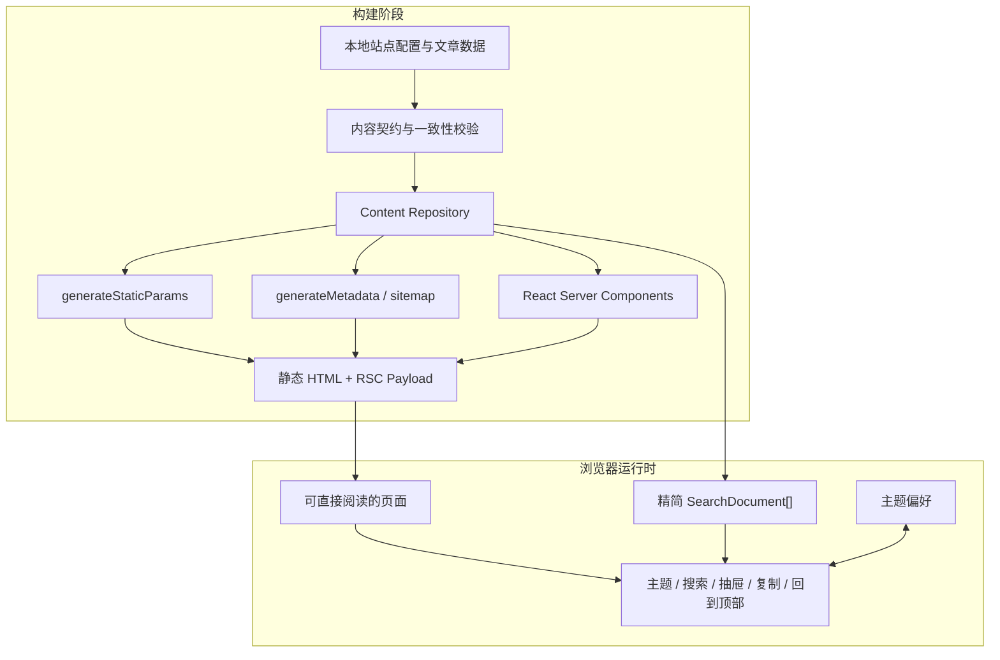

# Tessera Blog 布局样式复刻技术方案

## 1. 文档信息

| 项目 | 内容 |
| --- | --- |
| 需求基线 | `prd.md`，状态 `Ready for review` |
| 技术栈 | Next.js 16 App Router、React 19、TypeScript、Tailwind CSS 4、Base UI、lucide-react |
| 技术视角 | Next.js 全栈：渲染、服务端内容层、客户端交互、SEO、构建与部署 |
| 方案状态 | Ready for review |
| 设计日期 | 2026-08-13 |

## 2. 方案摘要

本期采用“静态内容仓库 + Server Components + 构建时静态生成 + 少量 Client Components 交互岛”的架构。

- 文章、标签、分类、作者和站点配置使用强类型本地数据，不接数据库、CMS 或远程 API。
- 页面主体由 Server Components 读取内容仓库并输出 HTML，动态路由在构建时通过 `generateStaticParams` 生成。
- 搜索弹层、移动抽屉、主题切换、代码复制和回到顶部作为独立 Client Components，不把整站转换成客户端应用。
- 搜索在浏览器内对精简的 `SearchDocument[]` 索引过滤，不传输文章正文，不新增搜索 Route Handler。
- 视觉系统由语义化 CSS variables、Tailwind utilities 和少量全局排版样式共同承载。
- P0 不新增大型运行时依赖，不创建数据库迁移，不引入认证、Server Actions 或业务 API。
- 为保证 Server/Client 边界可被编译器检查，可显式加入 Next.js 官方 marker 包 `server-only`；这是零运行时逻辑的小型边界依赖，不属于 UI 或状态框架。
- 内容层对页面暴露稳定的查询接口；未来接入 MDX、CMS 或数据库时替换 repository 实现，不改页面消费模型。

该方案满足 PRD 的布局复刻目标，同时保持首屏 HTML 完整、客户端 JavaScript 较小、SEO 友好，并为后续真实内容接入预留边界。

## 3. 设计原则

1. **Server First**：列表、聚合、详情和元信息尽量在服务端完成。
2. **Build-time First**：本地内容在构建阶段校验并预渲染；内容错误应阻止错误版本发布。
3. **Single Source of Truth**：文章是标签数、分类数、归档数和站点统计的唯一事实来源，不手写重复计数。
4. **Small Client Islands**：只有依赖浏览器状态或事件的功能使用 `"use client"`。
5. **Semantic Tokens**：组件只依赖 `background`、`card`、`primary`、`muted`、`border` 等语义变量，不散落参考站颜色值。
6. **No Reference Hotlinking**：所有内容和图片均来自本地，不向参考站发起运行时请求。
7. **Progressive Extensibility**：先用最小的本地 repository，未来数据源变化不影响路由和组件契约。

## 4. 总体架构



### 4.1 请求路径

1. 构建时载入本地内容并执行唯一性、引用和资产路径校验。
2. Next.js 为固定路由和有效 slug 生成静态页面。
3. 浏览器首次收到完整 HTML，无需等待客户端数据请求即可阅读。
4. React 仅水合交互岛；正文、卡片和侧栏不进入客户端 bundle。
5. 搜索使用服务端生成的精简索引，在本地即时过滤。

### 4.2 P0 不采用的能力

| 能力 | P0 决策 | 原因 |
| --- | --- | --- |
| 数据库 / ORM | 不采用 | 本期没有动态内容或写入需求 |
| CMS / MDX | 不采用 | PRD 只要求占位内容；结构化 TypeScript 数据足够且依赖最少 |
| Route Handlers | 不采用 | 没有公共 API、上传、Webhook 或服务端搜索需求 |
| Server Actions | 不采用 | 没有表单写入、认证或数据变更 |
| Middleware | 不采用 | 没有鉴权、国际化重写或边缘请求处理 |
| 全局状态库 | 不采用 | 交互状态局部且简单，React state/context 足够 |
| `output: "export"` | 暂不启用 | 默认预渲染已满足静态性能，同时保留未来接入动态数据的能力 |

## 5. 工程目录设计

```text
app/
├── layout.tsx                       # 根 HTML、metadata、主题启动脚本与公共站点 shell
├── globals.css                      # tokens、基础样式、文章排版、背景与 reduced-motion
├── page.tsx                         # /
├── not-found.tsx                    # 统一无效 slug 页面
├── error.tsx                        # 未预期运行时错误边界
├── sitemap.ts                       # 从 repository 生成站点地图
├── robots.ts                        # robots 配置
├── archives/page.tsx                # /archives
├── tags/
│   ├── page.tsx                     # /tags
│   └── [slug]/page.tsx              # /tags/[slug]
├── categories/
│   ├── page.tsx                     # /categories
│   └── [slug]/page.tsx              # /categories/[slug]
├── about/page.tsx                   # /about
└── posts/[slug]/page.tsx            # /posts/[slug]

components/
├── site/
│   ├── site-header.tsx
│   ├── site-footer.tsx
│   ├── nav-links.tsx                # 小型客户端激活态组件
│   ├── mobile-nav.tsx               # Base UI Drawer
│   ├── site-background.tsx
│   └── floating-tools.tsx
├── home/
│   ├── home-hero.tsx
│   ├── hero-banner.tsx
│   ├── category-shortcuts.tsx
│   └── featured-card.tsx
├── blog/
│   ├── post-card.tsx
│   ├── post-grid.tsx
│   ├── archive-timeline.tsx
│   ├── tag-cloud.tsx
│   ├── category-list.tsx
│   ├── post-hero.tsx
│   ├── post-body.tsx
│   ├── table-of-contents.tsx
│   ├── code-block.tsx               # 仅复制按钮部分为客户端
│   └── empty-state.tsx
├── sidebar/
│   ├── blog-sidebar.tsx
│   ├── profile-card.tsx
│   ├── announcement-card.tsx
│   ├── recent-posts-card.tsx
│   ├── taxonomy-cards.tsx
│   └── site-stats-card.tsx
├── search/
│   ├── search-provider.tsx
│   ├── search-trigger.tsx
│   └── search-dialog.tsx            # Base UI Dialog
├── theme/
│   ├── theme-boot-script.tsx
│   └── theme-toggle.tsx
└── ui/                              # 通用原子组件与现有 Button

content/
├── site.ts                           # 站点、作者、导航、公告、关于页配置
├── posts.ts                          # 至少 6 篇结构化占位文章
└── assets.ts                         # 本地资产路径常量（可选）

lib/
├── content/
│   ├── types.ts                      # 领域类型
│   ├── repository.ts                 # 服务端查询入口，import "server-only"
│   ├── derive.ts                     # 标签/分类/归档/统计派生
│   ├── validate.ts                   # 构建期不变量校验
│   └── search.ts                     # 生成可序列化搜索索引
├── metadata.ts                       # Metadata / JSON-LD helpers
├── routes.ts                         # 统一路由构造函数
├── date.ts                           # 日期格式化
└── utils.ts                          # 现有 cn 等通用工具

public/
└── images/
    ├── brand/
    ├── posts/
    └── placeholders/
```

目录按领域组织：页面负责组装，`components/blog` 负责表现，`lib/content` 负责数据和派生规则。页面不得直接遍历原始 `content/posts.ts`。

`repository.ts`、`validate.ts` 和服务端 metadata helpers 使用 `import "server-only"` 建立编译期边界；原始内容模块只允许被这些服务端入口导入，避免文章正文或构建校验逻辑被意外打入客户端 bundle。

本地环境若尚不能解析 `server-only`，实现阶段将其作为显式依赖加入；不以自定义空模块模拟该边界。`validate.ts` 可使用 Node `fs` 检查 `public/images` 文件存在性，但该模块不得配置为 Edge Runtime，也不得被 Client Component 导入。

## 6. 内容领域模型

### 6.1 核心类型

```ts
type Slug = string
type IsoDate = `${number}-${number}-${number}`

interface SiteConfig {
  name: string
  description: string
  siteUrl: string
  logo: LocalImage
  author: AuthorProfile
  announcement: string
  navigation: readonly NavigationItem[]
  about: AboutContent
}

interface PostRecord {
  slug: Slug
  title: string
  excerpt: string
  publishedAt: IsoDate
  updatedAt?: IsoDate
  category: Slug
  tags: readonly Slug[]
  cover: LocalImage
  featured?: boolean
  body: readonly ContentBlock[]
}

interface PostSummary {
  slug: Slug
  title: string
  excerpt: string
  publishedAt: IsoDate
  updatedAt?: IsoDate
  category: TaxonomySummary
  tags: readonly TaxonomySummary[]
  cover: LocalImage
  readingMinutes: number
  wordCount: number
}

interface PostDetail extends PostSummary {
  body: readonly ContentBlock[]
  toc: readonly TocItem[]
  previous: PostLink | null
  next: PostLink | null
}

interface TaxonomySummary {
  slug: Slug
  name: string
  count: number
}

interface SearchDocument {
  slug: Slug
  title: string
  excerpt: string
  category: string
  tags: readonly string[]
  publishedAt: IsoDate
}

interface LocalImage {
  src: `/images/${string}`
  alt: string
  width: number
  height: number
  blurDataURL?: string
}
```

`ContentBlock` 使用判别联合描述 P0 文章能力：

```ts
type ContentBlock =
  | { type: "heading"; level: 2 | 3; id: string; text: string }
  | { type: "paragraph"; children: readonly InlineContent[] }
  | { type: "list"; ordered: boolean; items: readonly string[] }
  | { type: "quote"; text: string; cite?: string }
  | { type: "image"; image: LocalImage; caption?: string }
  | { type: "code"; language: string; code: string }

type InlineContent =
  | { type: "text"; value: string }
  | { type: "link"; value: string; href: string; external?: boolean }
  | { type: "code"; value: string }
```

选择结构化 blocks 而不是在数据中保存 HTML，可避免 `dangerouslySetInnerHTML`，并让目录生成、代码块渲染、图片尺寸和外链规则保持可控。P0 不需要通用 Markdown 编译器。

### 6.2 数据不变量

构建阶段执行以下校验，任何失败均抛出带 slug 的可定位错误并终止 `pnpm build`：

- 文章 slug 全局唯一，且只包含小写字母、数字和连字符。
- 分类/标签 slug 存在于配置字典，文章不得引用未知 taxonomy。
- `publishedAt`、`updatedAt` 是合法日期，且更新时间不早于发布时间。
- 标题、摘要、正文和图片替代文本满足非空要求。
- 本地图片路径以 `/images/` 开头，并提供正数 `width/height`。
- 每篇文章的 heading `id` 唯一，层级只允许 `h2/h3`。
- 外链协议只允许 `https:` 和 `mailto:`；内部链接使用站内路径。
- 生产环境的 `SITE_URL` 是绝对 `https` URL；本地开发只允许回退到 `http://localhost:3000`。无效社交链接不进入渲染数据。

日期统一作为无时区的内容日期处理：校验 `YYYY-MM-DD` 后在 UTC 基准上排序，并使用同一服务端 formatter 输出，避免不同时区把发布日期显示成前一天。字数和阅读时长使用确定性规则派生（CJK 字符与拉丁词分别统计），同一文章在所有页面保持相同结果。

标签计数、分类计数、年份归档、文章总数、字数和阅读时长均由文章集合派生，不允许在页面或配置中重复手写。

### 6.3 Repository 契约

页面仅调用下列只读函数：

```ts
interface ContentRepository {
  getSiteConfig(): Promise<SiteConfig>
  getAllPosts(): Promise<readonly PostSummary[]>
  getRecentPosts(limit: number): Promise<readonly PostSummary[]>
  getPostBySlug(slug: string): Promise<PostDetail | null>
  getArchiveGroups(): Promise<readonly ArchiveYearGroup[]>
  getAllTags(): Promise<readonly TaxonomySummary[]>
  getPostsByTag(slug: string): Promise<readonly PostSummary[] | null>
  getAllCategories(): Promise<readonly TaxonomySummary[]>
  getPostsByCategory(slug: string): Promise<readonly PostSummary[] | null>
  getSearchIndex(): Promise<readonly SearchDocument[]>
  getSiteStats(): Promise<SiteStats>
}
```

P0 的实现是内存只读 repository。接口保持异步，以便未来切换为 `fetch`、数据库或 CMS 时不改变页面签名。文章列表按发布时间降序，taxonomy 列表按计数降序再按名称稳定排序，归档按年份降序；排序规则只存在于 repository 层。

配置字典中存在但计数为零的 taxonomy 属于“合法空状态”：`getPostsByTag()` / `getPostsByCategory()` 返回空数组；未知 slug 返回 `null` 并触发 Not Found。这样空状态与无效路由不会混淆。

## 7. 路由与渲染策略

| 路由 | 渲染方式 | 数据来源 | 404 策略 |
| --- | --- | --- | --- |
| `/` | 构建时静态生成 | 文章摘要、站点配置、统计 | 不适用 |
| `/archives` | 构建时静态生成 | 年份分组、侧栏数据 | 不适用 |
| `/tags` | 构建时静态生成 | 标签派生数据 | 不适用 |
| `/tags/[slug]` | `generateStaticParams` | 标签文章列表 | `dynamicParams = false` + `notFound()` |
| `/categories` | 构建时静态生成 | 分类派生数据 | 不适用 |
| `/categories/[slug]` | `generateStaticParams` | 分类文章列表 | `dynamicParams = false` + `notFound()` |
| `/about` | 构建时静态生成 | 站点关于配置 | 不适用 |
| `/posts/[slug]` | `generateStaticParams` | 文章详情、相邻文章、TOC | `dynamicParams = false` + `notFound()` |

### 7.1 动态路由约定

- 动态页导出 `generateStaticParams()`，参数直接来自 repository。
- 页面和 `generateMetadata()` 都通过同一个 `get*BySlug()` 查询，不分别实现查找规则。
- 按 Next.js 16 App Router 类型约定异步读取 `params`。
- 不存在的 slug 调用 `notFound()`；不使用客户端跳转模拟 404。
- P0 数据完全本地，不设置 `revalidate`；每次内容变更通过重新构建发布。

### 7.2 页面布局组合

```text
RootLayout
├── ThemeBootScript
├── SearchProvider + SearchDialog
├── SiteBackground
├── SiteHeader
├── route page
│   ├── StandardTwoColumnLayout
│   │   ├── MainContent
│   │   └── BlogSidebar
│   └── FullWidthLayout (tags/categories/about)
├── FloatingTools
└── SiteFooter
```

首页、归档、taxonomy 详情和文章详情复用双栏框架；标签总览、分类总览和关于页使用全宽框架。页面只传递 slot 内容，不复制容器结构。当前工程已经存在 `app/page.tsx`，因此公共 shell 直接落在根 `app/layout.tsx`，不新增会与现有首页发生路由冲突的 `(site)` route group，也不要求移动或删除现有首页文件。

## 8. Server / Client 边界

### 8.1 Server Components

默认以下模块均为 Server Components：

- 所有 `app/**/page.tsx` 和公共 layout。
- Hero、文章卡片、归档时间线、标签云、分类列表、侧栏卡片、正文和目录静态结构。
- 内容查询、聚合统计、metadata、JSON-LD、sitemap 和 Not Found 判断。

Server Components 负责把 `PostRecord` 转换为精简的页面 props，不把原始文章正文传给搜索或全局交互组件。

### 8.2 Client Components

仅以下组件声明 `"use client"`：

- `nav-links.tsx`：使用 `usePathname()` 计算当前导航激活态。
- `mobile-nav.tsx`：抽屉开关、焦点管理和 `Escape` 行为。
- `search-provider.tsx` / `search-dialog.tsx`：搜索状态与本地过滤。
- `theme-toggle.tsx`：读写主题偏好和更新根节点属性。
- `floating-tools.tsx`：监听滚动阈值和回到顶部。
- `code-block` 内的复制按钮：Clipboard API 与反馈状态。
- `app/error.tsx`：Next.js Error Boundary 按框架要求是 Client Component，但只负责错误重试/返回，不读取内容仓库。

不得因为一个按钮而把整张文章卡、整个 Header 或整个文章正文声明为 Client Component。交互按钮通过 props 接收可序列化数据。

## 9. 客户端交互设计

### 9.1 搜索

1. `SiteLayout` 在服务端调用 `getSearchIndex()`。
2. 仅将 `slug/title/excerpt/category/tags/publishedAt` 传入 `SearchProvider`。
3. 输入值先 `trim()`、转小写并做 Unicode 规范化。
4. 匹配优先级为标题 > 标签/分类 > 摘要；结果按匹配级别和发布时间排序。
5. 空输入显示引导文案；无结果显示空状态；最多展示合理数量并允许滚动。
6. 点击结果使用 `next/link` 前往 `/posts/[slug]`，同时关闭 Dialog。

Base UI Dialog 提供 modal 语义、focus trap、`Escape` 关闭和触发器焦点恢复；组件负责补齐标题、描述和可见关闭按钮。搜索不改变 URL，不保存历史，不请求服务端。

### 9.2 移动菜单

- 使用 Base UI Drawer，不自行实现焦点陷阱。
- Drawer 内只接收站点摘要、统计和导航链接，不接收完整文章列表。
- 路由跳转后关闭；桌面断点恢复时也关闭，避免隐藏状态残留。
- 开启时由组件控制 body scroll lock，关闭后恢复。

### 9.3 主题

- 根元素使用 `data-theme="light|dark"`，并将 Tailwind 4 的 custom dark variant 调整为匹配 `[data-theme="dark"]` 及其后代。
- `ThemeBootScript` 在首屏样式计算前读取 `localStorage`；无显式偏好时使用 `prefers-color-scheme`。
- `html` 添加 `suppressHydrationWarning`，只抑制根主题属性差异，不隐藏其他 hydration 问题。
- 用户切换后同步更新根属性和 `localStorage`；没有显式选择时监听系统主题变化。
- 主题脚本只处理有限字符串值，不接收用户 HTML，不依赖 Cookie 或服务端 session。

### 9.4 回到顶部

- 客户端使用 passive scroll listener 或 `IntersectionObserver` 判断按钮显示状态。
- 触发后调用 `window.scrollTo()`；`prefers-reduced-motion` 时使用即时跳转。
- 监听器在卸载时清理，不在每次滚动时触发 React 大范围重渲染。

### 9.5 代码复制

- 服务端渲染 `<pre><code>` 和语言标签，客户端复制按钮只接收纯文本代码。
- 首选 `navigator.clipboard.writeText()`；失败时显示非破坏性失败反馈，不修改正文。
- 成功/失败提示使用 `aria-live="polite"`，若无代码块则不发送该组件 JavaScript。

## 10. 视觉系统与响应式实现

### 10.1 Design Tokens

`app/globals.css` 统一维护以下语义变量：

```css
:root {
  --background: #f7f9fe;
  --foreground: #4c4948;
  --card: rgb(255 255 255 / 88%);
  --card-foreground: #1f2d3d;
  --primary: #425aef;
  --primary-foreground: #fff;
  --muted: #f1f4fb;
  --muted-foreground: #858585;
  --border: #e3e8f7;
  --ring: #425aef;
  --glass-blur: 10px;
  --card-radius: 12px;
  --card-shadow: 0 8px 16px -4px rgb(44 45 48 / 5%);
  --card-shadow-hover: 0 12px 26px -6px rgb(66 90 239 / 15%);
  --page-max: 87.5rem;
  --nav-height: 3.5rem;
}
```

`[data-theme="dark"]` 只覆盖语义变量；现有 `.dark` 方案将被统一迁移，避免两套主题选择器并存。标签色板额外提供有限的 `--tag-blue/green/pink/purple/orange` 及对应浅背景，禁止按标签名称生成任意颜色。

### 10.2 Tailwind 4 分工

- `globals.css`：tokens、字体基线、页面背景、玻璃卡片基类、文章 prose 样式、滚动偏移和 reduced-motion。
- Tailwind utilities：组件布局、间距、网格、文本层级和交互状态。
- `class-variance-authority`：Button、TagPill 等存在明确 variant 的组件。
- 禁止在 JSX 中重复大段任意值；重复三次以上的视觉组合提取组件或语义类。

### 10.3 Breakpoints

Tailwind 4 中定义项目级断点，使用 mobile-first 规则：

| Token | 宽度 | 作用 |
| --- | --- | --- |
| base | `< 600px` | 紧凑手机布局 |
| `sm` | `600px` | 恢复标准卡片内边距 |
| `md` | `768px` | 桌面导航、Hero 组合过渡 |
| `content` | `900px` | 主内容与侧栏切换双栏 |
| `lg` | `1024px` | 完整两列文章网格和桌面密度 |

核心布局使用 CSS Grid：

- 双栏框架：`minmax(0, 1fr) minmax(18rem, 20rem)`。
- 首页文章：移动单列，`lg` 后 `repeat(2, minmax(0, 1fr))`。
- Hero：移动纵向，桌面为约 3:1 的左右网格；左侧内部再分主视觉和三张分类卡。
- 所有可收缩列必须使用 `minmax(0, 1fr)`，图片父容器使用固定比例，避免水平溢出。

### 10.4 图片策略

- 所有图片置于 `public/images`，用 `next/image` 渲染。
- `LocalImage` 必须提供宽高，卡片封面使用固定 `aspect-ratio` 和 `object-cover`。
- 首页首屏主视觉按实际 LCP 情况设置 `priority`，其余图片懒加载。
- 不配置 `remotePatterns`，从配置层阻止远程图片热链。
- SVG 仅用于项目自有抽象装饰；纯装饰使用空 `alt` 和 `aria-hidden`。

## 11. SEO 与可发现性

### 11.1 Metadata

- 根 layout 设置 `metadataBase`、默认 title template、description、Open Graph 和 Twitter card 基线。
- 文章、标签和分类详情导出 `generateMetadata()`，数据来自 repository。
- 无效 slug 的 metadata 查询与页面使用同一查找函数，并最终进入 `notFound()`。
- 每页只有一个 `h1`；文章正文从 `h2` 开始。

### 11.2 站点地图与 robots

- `app/sitemap.ts` 从固定路由、文章、标签和分类生成 URL；日期使用内容更新时间。
- `app/robots.ts` 允许公开页面并指向 sitemap。
- `SiteConfig.siteUrl` 是生成绝对 URL 的唯一来源，不在页面散落域名。

### 11.3 结构化数据

- 首页输出 `WebSite` / `Blog` JSON-LD。
- 文章详情输出 `BlogPosting`，只使用本项目占位标题、日期、作者和封面。
- JSON-LD 使用受控对象序列化，不拼接用户提供的 HTML 字符串。

## 12. 可访问性设计

- 根布局提供“跳到主要内容”链接，目标为唯一的 `<main id="main-content">`。
- Header 使用 `<nav aria-label="主导航">`，当前项设置 `aria-current="page"`。
- Base UI Dialog/Drawer 承担 focus trap；必须提供可见标题、描述和关闭按钮。
- Icon-only 按钮统一通过 `aria-label` 命名，tooltip 不能替代可访问名称。
- Tag 与 Category 使用真实链接，不使用带 click 的 `div`。
- 文章封面是信息图片时使用文章标题作为替代文本；装饰背景空 `alt`。
- focus ring 使用 `--ring`，不得被 `outline: none` 无替代地移除。
- `@media (prefers-reduced-motion: reduce)` 关闭卡片位移、背景漂浮和顺滑滚动。
- 目录锚点设置 `scroll-margin-top: calc(var(--nav-height) + 1rem)`，避免固定导航遮挡标题。

## 13. 安全与数据边界

### 13.1 当前信任边界

- `content/*.ts` 是仓库内受信任源，但仍执行结构和引用校验，防止构建错误。
- 搜索输入是不可信字符串，只用于内存比较，不进入 HTML、SQL、文件路径或服务端日志。
- 不使用 `dangerouslySetInnerHTML` 渲染文章；正文通过结构化组件输出并由 React 转义。
- 外链统一校验协议，并设置 `target="_blank"` 时同时设置 `rel="noopener noreferrer"`。
- 本期无认证、Cookie、表单提交、文件上传、Secret 或付费服务。

### 13.2 未来内容源要求

如果未来引入 Markdown/MDX、CMS 或数据库：

- repository 必须把外部数据验证为当前领域类型后再交给页面。
- 任意 HTML 必须在服务端经过 allowlist sanitizer；默认禁止脚本、事件属性和 iframe。
- CMS Token 仅保存在服务端环境变量，禁止进入 `NEXT_PUBLIC_*` 或客户端 bundle。
- 数据写入、预览和 Webhook 另行设计鉴权、CSRF、速率限制与审计，不复用本期只读假设。

## 14. 性能与缓存策略

### 14.1 P0

- 本地内容由构建过程直接读取，不产生运行时数据库或 HTTP 请求。
- 所有内容页预渲染；部署后可由 CDN 缓存静态产物。
- 页面列表使用 `PostSummary`，正文只存在于文章详情 HTML/RSC payload。
- 搜索索引不含正文和图片对象，降低客户端序列化与 hydration 成本。
- Header、卡片、侧栏和正文保持 Server Components，避免无效 hydration。
- 字体优先复用 `next/font`；中文回退系统字体，避免额外下载大体积中文字体。

### 14.2 性能风险控制

- 首屏只将真正的 LCP 图片标记为 `priority`，避免抢占所有图片请求。
- 背景装饰优先 CSS/SVG，不用大图或持续 JavaScript 动画。
- scroll listener 使用 passive 选项并做阈值更新；不在滚动时重算整页布局。
- 玻璃模糊只作用于有限卡片/导航，不给整个长页面添加大面积 `backdrop-filter`。
- 搜索结果集合规模增长到数百篇前继续使用本地过滤；超过阈值后再评估预构建倒排索引或服务端搜索。

### 14.3 未来动态源

未来切换 CMS 时，repository 可使用 Next.js `fetch` 缓存和 tag-based revalidation。页面组件不直接持有缓存策略；缓存、重验证和失败回退由 repository adapter 负责。

## 15. 错误处理与空状态

- 构建期内容错误：抛出明确错误并停止构建，不静默跳过坏文章。
- 无效动态 slug：服务端 `notFound()`，展示统一 Not Found 页面。
- 合法 taxonomy 无文章：渲染 PRD 定义的卡片化空状态和返回入口。
- 图片不可用：构建检查本地路径；运行时保留背景色和尺寸，避免布局坍塌。
- Clipboard API 失败：按钮进入失败提示，正文保持可选择，页面不抛异常。
- 未预期渲染错误：`app/error.tsx` 提供重试和返回首页入口；错误详情不直接展示给用户。

## 16. 测试与验证策略

### 16.1 静态质量门

- `pnpm lint`：ESLint 与 Next.js 规则。
- `pnpm build`：TypeScript、Server/Client 边界、动态路由预生成和内容不变量。
- repository 校验在构建可达路径中执行，保证坏数据无法绕过检查。

当前项目没有测试框架，P0 不为简单静态 selectors 强制引入大型测试依赖。若派生逻辑在实现中明显复杂，再单独增加轻量单元测试方案，不在本设计中预设 Jest/Vitest。

### 16.2 浏览器验证矩阵

| 页面 | `1440 × 900` | `1024 × 768` | `390 × 844` | 深色模式 | 键盘 |
| --- | --- | --- | --- | --- | --- |
| 首页 | 必测 | 必测 | 必测 | 必测 | 导航/搜索/菜单 |
| 文章详情 | 必测 | 必测 | 必测 | 必测 | TOC/复制/返回顶部 |
| 归档或 taxonomy 详情 | 必测 | 抽查 | 必测 | 抽查 | 时间线链接 |
| 标签/分类总览 | 必测 | 抽查 | 必测 | 抽查 | 胶囊/列表链接 |
| 关于 | 必测 | 抽查 | 必测 | 抽查 | 社交链接 |

浏览器核验需检查：

- `document.documentElement.scrollWidth <= viewport width`。
- 固定导航不遮挡锚点标题。
- Dialog/Drawer 可用 `Escape` 关闭且焦点返回触发器。
- 主题刷新保持，首屏没有明显错误主题闪烁。
- 图片不变形、卡片不跳动、hover/focus 状态一致。
- Network 中不存在 `tessera-blog.vercel.app` 运行时请求。

### 16.3 PRD 对应关系

| 设计模块 | 覆盖验收 |
| --- | --- |
| App Router + repository + static params | AC1–AC4 |
| Design tokens + Grid 布局 +页面组件 | AC5–AC10 |
| Base UI Dialog/Drawer + Client Islands | AC11、AC13、AC14、AC20 |
| ThemeBootScript + theme tokens | AC12 |
| ContentBlock renderer + CodeBlock | AC15 |
| reduced-motion + FloatingTools | AC16 |
| 构建和浏览器验证 | AC17–AC19 |

## 17. 部署、兼容与回滚

### 17.1 部署形态

- 推荐部署到 Vercel 或兼容 Next.js 16 的 Node 平台。
- P0 页面为静态预渲染产物，不依赖常驻数据库或后台任务。
- `SiteConfig.siteUrl` 在 server-only 配置入口中由 `SITE_URL` 解析；生产发布必须显式配置稳定的正式域名，Preview 不把临时域名写成生产 canonical。
- 先使用 Preview Deployment 完成三档视口与 Network 检查，再发布生产。

### 17.2 浏览器兼容

- 目标为当前主流 Chrome、Safari、Firefox 和 Edge。
- 不支持 `backdrop-filter` 的浏览器使用不透明卡片背景降级，信息结构保持完整。
- Clipboard API 不可用时显示失败提示，用户仍可手动选择代码。
- `prefers-color-scheme`、`prefers-reduced-motion` 均作为增强能力，不影响基础阅读。

### 17.3 回滚

- 本期无数据库 schema、远程资源或不可逆外部状态。
- 当前项目根目录尚未初始化 Git，实施时不能把“回滚到上一提交”作为唯一恢复手段。每阶段修改前需记录影响文件并为既有文件建立可恢复的文件级检查点，阶段验证失败时只反向恢复该阶段文件。
- 如果用户后续初始化 Git，则可在每个通过质量门的阶段建立提交级检查点；部署平台仍可回退到上一个成功构建。
- 内容模型未来发生不兼容变化时，先保留旧 adapter，再迁移数据；不得在同一发布中同时删除旧读取能力和变更全部内容。

## 18. 关键权衡

### 18.1 结构化 TypeScript 内容 vs MDX

选择结构化 TypeScript blocks：

- 优点：不新增编译依赖、类型明确、无原始 HTML、适合 6 篇占位内容、TOC 和代码块可控。
- 代价：长文编写体验不如 Markdown。
- 结论：符合本期复刻布局目标；真实内容生产需求出现后再引入 MDX adapter。

### 18.2 客户端搜索 vs Route Handler

选择客户端搜索：

- 优点：无网络延迟、无需 API 和缓存、离线可用、实现边界小。
- 代价：索引会进入客户端 bundle，超大内容量不可扩展。
- 结论：P0 仅 6+ 占位文章，精简索引成本可忽略；规模显著增长时再切服务端搜索。

### 18.3 预渲染 vs 请求时 SSR

选择预渲染：

- 优点：内容稳定、CDN 友好、首屏快、无运行时数据故障。
- 代价：内容更新需要重新构建。
- 结论：本地占位内容与当前需求完全匹配，且 repository 保留未来动态化接口。

### 18.4 自建弹层 vs Base UI

选择现有 Base UI Dialog/Drawer：

- 优点：复用已安装依赖，获得焦点管理、modal 语义和键盘行为。
- 代价：需要适配其组件 API 和样式结构。
- 结论：相比自建 focus trap 风险更低，不增加新依赖。

## 19. 后续演进路径

1. **MDX adapter**：将正文来源切为本地 MDX，repository 输出保持 `PostDetail`。
2. **CMS adapter**：通过服务端 fetch 读取内容，增加缓存标签和按需重验证。
3. **数据库与管理端**：只有出现真实编辑、草稿、权限和发布流程时再引入。
4. **搜索升级**：文章达到数百篇后评估构建期倒排索引；再大规模时使用服务端搜索服务。
5. **P1 交互**：单/双栏、TOC 滚动高亮、图片预览和更丰富动效独立追加，不能扩大 P0 客户端边界。

## 20. 已决事项与开放问题

### 已决事项

- 使用 Next.js App Router 与 Server Components。
- P0 内容存储为本地强类型结构化数据。
- 所有有效动态路由构建时生成，无效 slug 服务端 404。
- 无数据库、CMS、业务 API、Server Actions、认证和写操作。
- 搜索使用精简客户端索引；主题使用根属性和本地偏好。
- 所有图片本地化，不允许参考站热链。

### 开放问题

无阻塞技术问题。进入实现前仍需创建 `implement.md`，将本方案拆分为有序的代码变更、验证命令和回滚点；本文件本身不授权开始实现。
