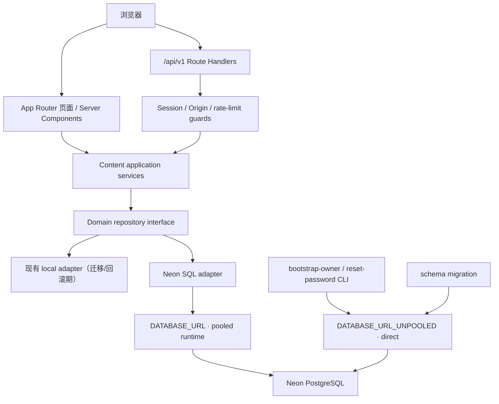
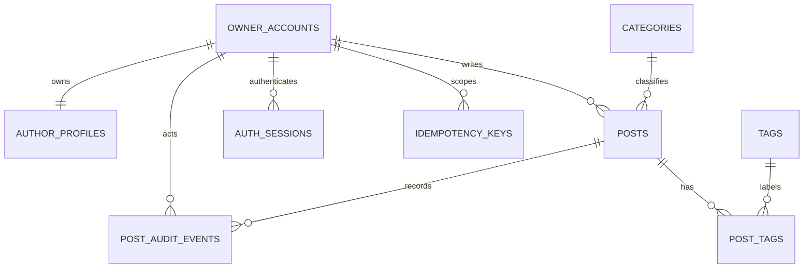
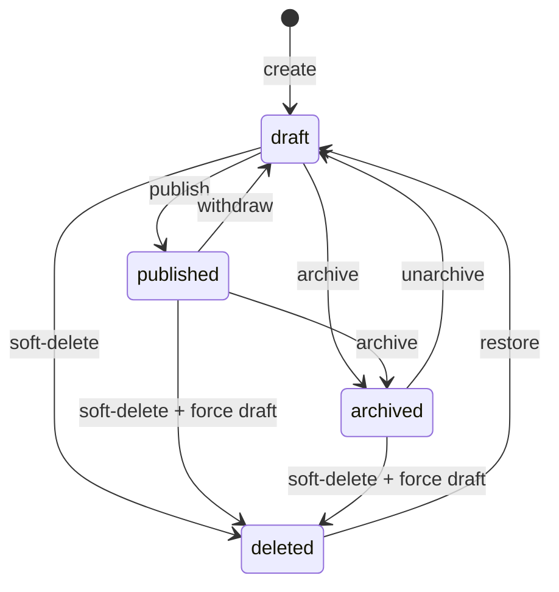

# 单账号个人博客 Neon 全栈技术方案

## 1. 方案状态

| 项目 | 内容 |
| --- | --- |
| 产品 | 单账号个人博客 |
| 框架 | Next.js 16 App Router、React 19、TypeScript |
| 数据库 | Neon PostgreSQL |
| 认证 | 项目自研邮箱密码 + opaque session |
| 数据访问 | SQL-first repository + `@neondatabase/serverless` |
| 当前交付 | 设计、API 契约、baseline SQL 与已批准的登录认证切片 |
| 当前不执行 | 远程建库/SQL、公开内容 Neon 切换、文章 CRUD/action 与编辑 UI |

## 2. 方案摘要

本方案保留现有页面只依赖 `lib/content/repository.ts` 的边界，在 repository 后新增 Neon adapter；React Server Components 直接调用服务端 repository，不绕行本项目 HTTP API。`app/api/v1/**` Route Handlers 与页面复用同一 application service、验证器和 SQL repository，从而避免公开页面与 API 出现两套统计、排序或状态规则。

唯一站长账号通过本地 `bootstrap-owner` CLI 初始化，以邮箱和密码登录。浏览器获得高熵 opaque session Cookie，数据库只保存 token hash。站长文章写操作使用短事务、参数化 SQL、乐观并发、action 状态机和同事务审计；公开读取永远从 `blog.public_posts` 的可见性边界开始。

运行时使用 Neon pooled connection，migration、bootstrap 和凭据恢复使用 direct connection。设计不依赖 PgBouncer transaction mode 无法保证的 session 状态。

## 3. 架构边界



### 3.1 请求路径

公开页面：

1. Server Component 调用 domain repository。
2. Neon adapter 从 `blog.public_posts` 和 taxonomy 表查询。
3. adapter 把数据库行映射为当前 `PostSummary` / `PostDetail` 等领域类型。
4. 页面继续使用现有组件，不了解 UUID、状态、session 或数据库列。

站长写请求：

1. Route Handler 校验 JSON、Origin、Cookie 和 session。
2. service 从 session 取得唯一 `ownerId`，忽略或拒绝客户端的身份字段。
3. service 校验 DTO 与状态动作，repository 执行带 `owner_id`、`version` 的参数化 SQL。
4. 文章变更、tag 关系与 audit event 在同一短事务中提交。
5. 提交成功后失效公开 cache tags；失败时不产生部分写入。

### 3.2 不通过内部 HTTP 调用自己

Server Components、metadata、sitemap 和 Route Handlers 均运行在服务端。页面不得通过 `fetch('/api/v1/...')` 读取本应用 API，这会增加一次网络跳转、重复序列化并使认证/缓存语义复杂化。HTTP API 供浏览器编辑能力或外部只读调用；服务端内部直接复用 service/repository。

## 4. 建议目录

```text
app/
└── api/v1/
    ├── site/route.ts
    ├── posts/route.ts
    ├── posts/[slug]/route.ts
    ├── archives/route.ts
    ├── tags/route.ts
    ├── tags/[slug]/posts/route.ts
    ├── categories/route.ts
    ├── categories/[slug]/posts/route.ts
    ├── search/route.ts
    ├── stats/route.ts
    ├── sidebar/route.ts
    ├── auth/
    │   ├── login/route.ts
    │   ├── logout/route.ts
    │   ├── refresh/route.ts
    │   ├── me/route.ts
    │   └── sessions/...
    └── me/
        ├── profile/route.ts
        ├── audit-events/route.ts
        └── posts/
            ├── route.ts
            └── [id]/
                ├── route.ts
                ├── publish/route.ts
                ├── withdraw/route.ts
                ├── archive/route.ts
                ├── unarchive/route.ts
                └── restore/route.ts

lib/
├── auth/
│   ├── password.ts
│   ├── session.ts
│   ├── cookie.ts
│   ├── origin.ts
│   └── rate-limit.ts
├── db/
│   ├── env.ts
│   ├── runtime.ts
│   ├── direct.ts
│   ├── errors.ts
│   └── sql/
├── content/
│   ├── repository.ts          # 稳定领域入口
│   ├── local-repository.ts    # 迁移/回滚期保留
│   ├── neon-repository.ts
│   ├── types.ts
│   ├── derive.ts
│   └── validate.ts
├── posts/
│   ├── service.ts
│   ├── state-machine.ts
│   └── validators.ts
└── api/
    ├── response.ts
    ├── errors.ts
    ├── cursor.ts
    └── validation.ts

scripts/
├── bootstrap-owner.mjs
├── reset-owner-password.mjs
└── import-local-content.mjs

db/
└── migrations/
    └── 0001_baseline.sql
```

当前任务只在 Trellis 任务目录产出设计文件；以上是后续批准实施时的目标结构。

## 5. 数据库连接设计

### 5.1 两类连接串

| 环境变量 | Neon hostname | 使用者 | 用途 |
| --- | --- | --- | --- |
| `DATABASE_URL` | 带 `-pooler` | Next.js runtime | 页面读取、Route Handlers、短事务 |
| `DATABASE_URL_UNPOOLED` | direct | migration/CLI | baseline migration、bootstrap、密码恢复、dump/restore |

- 两个变量都只允许出现在服务端环境，禁止使用 `NEXT_PUBLIC_*`。
- production/preview/development 使用不同 Neon branch/database 和不同 Secret，不共享生产账号。
- `lib/db/runtime.ts` 只能读取 `DATABASE_URL`；`lib/db/direct.ts` 只能由 `scripts/**` 或 migration 工具导入，并加 `server-only`/入口约束。
- 日志与错误响应不得输出连接串；错误清洗时同时屏蔽 query 参数和 hostname 中的凭据。

### 5.2 Driver 选择

首选 `@neondatabase/serverless`：

- one-shot 查询使用 `neon(DATABASE_URL)` 的 HTTP 模式；
- 多语句但不需要中途应用决策的短事务使用 driver 的 non-interactive transaction；
- 需要条件写入的流程优先合并为参数化 CTE，例如 `UPDATE ... WHERE version = $n RETURNING` + audit insert；
- 当前工作流不要求长期 session 或跨请求事务，因此不引入常驻 client。

若后续确实出现无法由单语句/非交互事务表达的交互事务，再在 Node runtime 内评估 serverless driver 的 `Pool`/`Client`。不能因为 driver 支持 session 就依赖跨事务连接亲和性。

### 5.3 PgBouncer transaction mode 约束

所有 SQL 使用 `blog.table_name` 全限定名，并遵守：

- 不依赖 session 级 `SET search_path`、`SET ROLE` 或其他会话变量；
- 不使用 `LISTEN/NOTIFY` 作为可靠业务队列；
- 不使用 session advisory lock；如需锁，只在同一事务中使用 transaction-scoped lock；
- 不使用跨事务临时表或 prepared statement session 状态；
- 事务只包围完成一个业务原子性的必要 SQL，不在事务中进行网络调用、密码哈希或 React 渲染。

## 6. 数据模型说明

[`schema.sql`](./schema.sql) 是 baseline。核心关系：



### 6.1 单账号不变量

`owner_accounts.singleton_key` 只能为 `1` 且具有 UNIQUE 约束，因此数据库最多存在一行账号。它不是“先实现多租户、UI 暂时只显示一个账号”，而是数据库和 API 都明确为单账号模型。

文章仍保存 `owner_id`，原因是：

- 每条写 SQL 能显式绑定已认证主体；
- session、审计和文章事实形成清楚外键链；
- 客户端永远不需要也不能决定该值。

这个字段不代表本期支持多作者，也不应派生公开作者 URL。

### 6.2 JSON 与关系数据边界

- 有独立查询、唯一性或引用语义的 category/tag 使用规范化表。
- 有序且作为文章整体编辑的 `ContentBlock[]` 使用 `jsonb`。
- navigation、author links、about 等小型单例配置使用 `jsonb`，不为低频配置拆出大量表。
- SQL 只验证 JSON 顶层类型和发布时非空；应用层验证每个 block 的判别字段、合法 URL、heading ID 唯一性和本地图片约束。
- 未经 DTO 校验的数据库 JSON 不得直接传入 React 组件。

### 6.3 派生值

以下值不作为多份事实持久化：

- taxonomy `count`：从公开文章关系 count；
- archive 年份与站点 years：从 `published_at`；
- `wordCount` / `readingMinutes`：复用当前 `derive.ts` 的 CJK + Latin 算法从 blocks 计算；
- TOC：从 heading blocks 生成；
- previous/next：在公开时间线按 `published_at DESC, id DESC` 计算；
- search document：从文章、category 和 tags 投影。

若性能数据证明按请求计算不可接受，可以增加带明确刷新策略的物化层；MVP 不先复制事实。

### 6.4 索引依据

| 索引 | 对应查询 |
| --- | --- |
| `posts_public_timeline_idx` | 首页、recent、归档、previous/next |
| `posts_public_category_idx` | 分类文章列表 |
| `post_tags_tag_post_idx` | 标签文章列表和标签计数 |
| `posts_owner_active_idx` | 站长状态筛选列表 |
| `posts_owner_deleted_idx` | 回收站 |
| `*_trgm_idx` | 标题、摘要和 taxonomy 子串搜索 |
| `auth_sessions_*` | Cookie token 查询、session 管理和过期清理 |
| `post_audit_events_*` | 文章/账号审计时间线 |
| `idempotency_keys_expiry_idx` | 过期记录维护 |

索引以真实 API 查询为依据；不为低频字段建立猜测性索引。

## 7. 认证设计

### 7.1 初始账号

`bootstrap-owner` CLI：

1. 只读取 `DATABASE_URL_UNPOOLED`。
2. 交互式读取 normalized email 和隐藏密码；密码不得作为命令行参数，避免进入 shell history/process list。
3. 在连接数据库前完成密码强度校验和 Argon2id hash。
4. 事务内插入 `owner_accounts`、`author_profiles` 和缺失的 `site_settings` 初始行。
5. 如果账号已经存在，明确失败，不执行 upsert 或覆盖密码。
6. 成功日志只输出账号 ID/email，不输出 password、hash 或连接串。

凭据恢复使用独立 `reset-owner-password` CLI：

1. 用 direct connection 锁定唯一账号行。
2. 在事务内更新 `password_hash`、`password_changed_at`，并把该账号所有未撤销 session 标记为 revoked。
3. 事务失败则密码与 session 状态都不改变。
4. 不提供邮件、Web token 或隐藏注册 URL。

### 7.2 Password hashing

- 当前算法选择 Argon2id，schema 仅保存算法编码 hash，保持未来可升级。
- 实施时在目标部署环境进行时间/内存参数基准测试，目标是在安全与登录延迟之间取得可测平衡；参数不能只复制未知硬件上的示例。
- 校验成功且 hash 参数落后时，可在登录成功事务外计算新 hash，再以乐观条件更新；任何重哈希失败不应破坏本次安全登录结果。
- 密码、hash、认证 header 和 session Cookie 均不得进入日志、audit `changes` 或错误 `details`。

### 7.3 Opaque session

- token 使用 CSPRNG 生成至少 256 bit 随机值，以 base64url 放入 Cookie。
- 数据库存 `SHA-256(token)` 的 32-byte `bytea`；查询时对客户端 token 计算 hash 后参数化匹配。
- session 有绝对过期时间；`refresh` 轮换 token，旧记录先撤销或在同一事务中替换。
- `last_seen_at` 节流更新，例如最多每 5 分钟一次，避免每个公开请求写数据库。
- logout/revoke/reset-password 都以数据库 `revoked_at` 为权威；清 Cookie 只是浏览器清理，不是撤销机制。

### 7.4 登录限速与防枚举

- 同时对 normalized email 和可信客户端 IP 的 HMAC key 计数，数据库不保存原始 IP。
- 只有在已配置并信任部署代理时读取其转发 IP header；不得信任任意客户端传入的 `X-Forwarded-For`。
- 不存在账号与密码错误使用相同响应、近似计算成本和同一限速规则。
- 触发限速返回 `429` 和 `Retry-After`；具体窗口/阈值在实现阶段通过配置和测试固化。

## 8. 文章状态与事务

### 8.1 状态模型



`deleted` 是图中的可见概念，数据库用 `deleted_at` 表示，并要求 deleted row 的 `status = draft`。恢复永远回到草稿，防止文章在用户只点击“恢复”时意外重新公开。

`published_at` 表示首次发布时间，撤回和重新发布不重写；这样 archive、上一篇/下一篇和公开 URL 的时间线稳定。若未来产品需要“每次重新发布都更新发布日期”，应新增独立产品决策，不能复用 `row_updated_at` 偷换语义。

### 8.2 乐观并发

版本由数据库 trigger 在每次文章 update 时递增。service 仍必须在 update predicate 中传入客户端版本：

```sql
UPDATE blog.posts
SET title = $1
WHERE id = $2
  AND owner_id = $3
  AND version = $4
  AND deleted_at IS NULL
RETURNING *;
```

返回 0 行时，用同一 owner 边界检查资源：不存在返回 404，存在但版本不同返回 409。不能先无锁读取版本再无条件更新。

### 8.3 原子写入

- 编辑：update post + replace `post_tags` + insert audit。
- 发布：带 version/status 条件 update + audit。
- 删除/恢复/归档动作：状态 update + audit。
- 创建：claim idempotency key + insert draft + audit + persist idempotent response。
- 密码恢复：update password + revoke all sessions。

这些操作必须在一个短事务中提交。密码 hash、JSON schema 验证、图片路径规则和响应序列化在事务外完成；事务内只做最终数据库约束与写入。

## 9. 查询与搜索

### 9.1 公开可见性

所有公开查询从 `blog.public_posts` view 开始。即使调用方已用 slug 定位，也不能从 `blog.posts` 读取后在 TypeScript 中再判断状态，否则 cache、metadata 或错误分支容易泄露草稿。

未知 post、非公开 post 和已删除 post 对匿名调用统一为 404。taxonomy 先从 definition 表查询：definition 不存在为 404；存在但关联公开文章为 0 时返回 200 + `[]`。

### 9.2 Search

MVP 使用 `pg_trgm` 支持中英文子串搜索，同时保持当前权重：title 3、category/tag 2、excerpt 1。查询规则：

- 输入先执行 NFKC、trim 和 `toLocaleLowerCase('zh-CN')`；
- SQL 参数化传值，并转义 LIKE 语义中的 `\\`、`%`、`_`，避免用户输入改变匹配规则；
- title/excerpt 使用 trigram GIN；taxonomy 使用 name trigram 与 EXISTS/join；
- 只返回精简 `SearchDocument`，不传正文；
- 同权重按公开时间线排序，cursor 包含 score、published time 和 ID。

不使用动态列名或把用户输入拼进 SQL。若未来增加可选排序，必须通过代码 allowlist 映射到固定 SQL，而不是参数化标识符。

## 10. Next.js 渲染与缓存

### 10.1 动态内容对现有页面的影响

当前 post/tag/category 动态页导出 `dynamicParams = false`，只允许构建时已知 slug。接入发布流程后必须移除该限制或改为允许动态参数，否则新发布文章会在下一次 build 前持续 404。

建议：

- 页面保留 Server Components；
- `dynamicParams` 使用默认 `true`；
- `generateStaticParams` 可只作热门内容预热，也可移除，不能成为新内容可见性的前置条件；
- `generateMetadata`、sitemap、页面和 API 复用同一公开 repository；
- 新发布内容通过 cache tag invalidation 在运行时生效，不要求重新部署。

### 10.2 Cache tags

建议 tag：

| Tag | 数据 |
| --- | --- |
| `site` | 站点/作者配置 |
| `posts` | 公开文章列表与 recent |
| `post:{slug}` | 单篇详情/metadata |
| `archives` | 归档 |
| `tags` / `tag:{slug}` | 标签总览/详情 |
| `categories` / `category:{slug}` | 分类总览/详情 |
| `search` | 搜索投影 |
| `stats` | 统计与 sidebar |

发布或公开文章内容更新时失效对应 post、列表、taxonomy、archive、search、stats、sitemap。撤回、归档和删除必须先提交数据库，再失效同一组 tag；失效失败记录告警并允许较短 TTL 自动收敛。受保护数据不使用公共 cache。

具体采用 Next.js 16 当前稳定的 cache API 时，应封装在 repository/cache adapter 中，避免页面组件散布 cache key。`api.md` 的 HTTP cache header 与服务端数据 cache 是两层独立机制，均不能缓存草稿。

## 11. API Route Handler 设计

每个 Route Handler 只负责：

1. 生成/接收 request ID；
2. 解析并验证 path/query/body；
3. 对写请求执行 Origin 校验；
4. 对受保护请求调用 `requireOwnerSession`；
5. 调用 service；
6. 把 domain error 映射为统一 envelope/status；
7. 设置 Cookie、cache header 和可观测性字段。

业务状态机、SQL、password 逻辑不能直接写在 `route.ts`。所有 auth 和 mutation Route Handlers 使用 Node.js runtime，避免 Argon2 实现与 Edge runtime 的兼容不确定性；公开读取也先统一 Node runtime，只有获得性能证据后再拆分。

## 12. 迁移方案

### 12.1 数据迁移顺序

1. 在隔离 Neon branch 使用 direct connection 执行 baseline migration。
2. 运行 schema 静态/临时数据库验证，确认约束、trigger 和 index。
3. 运行 `bootstrap-owner` 创建唯一账号、profile 和 site settings。
4. 用 `import-local-content` 导入 `content/site.ts` 与 `content/posts.ts`：先 taxonomy，再 posts/tag relations；保留现有 slug 与发布日期。
5. 对数据库 adapter 与 local adapter 执行契约对照：数量、排序、slug、DTO、前后篇、word count、taxonomy count、搜索结果。
6. 通过 server-only feature flag 将 read source 从 local 切到 Neon。
7. 修改动态路由和 cache invalidation，验证新草稿不公开、新发布无需 rebuild 可见。
8. 稳定后再考虑移除 local adapter；不在首次切换中删除回滚数据源。

### 12.2 Rollback

- schema 部署失败：丢弃隔离 Neon branch；不对生产库做手工逆向删除。
- import 失败：回滚 import transaction 或重建 branch；local content 保持事实源。
- runtime 读取失败：feature flag 切回 local adapter，保留 Neon 数据以便诊断。
- 写功能上线后发生问题：暂停 mutation UI/API，公开读取可继续从 Neon 或 local；不得用回滚代码覆盖已写入文章。
- 任何 destructive migration 必须另立任务、备份/branch 验证并获得用户批准；不属于本 baseline。

## 13. 权限与运维边界

- migration role 拥有 schema DDL；runtime role 只有 `blog` schema 使用权和所需表 DML，不授予 `CREATE`。
- baseline SQL 不创建真实 role 或 Secret，role 名只在部署步骤中配置。
- 当前单账号并不降低认证要求：数据库公网可达、Cookie 泄露或未认证 Route Handler 仍会造成完整站点被篡改。
- 不把 `neondb_owner` 作为运行时应用账号。
- 清理过期 sessions、rate-limit rows、idempotency rows 可由受控定时任务完成；清理操作必须用 direct 或合适的短事务，不能在用户请求中全表删除。
- 本期不落地 backup、PITR、跨区域容灾和生产监控；生产上线前必须另行确认这些能力。

## 14. 可观测性与错误处理

- 每个请求有 UUID request ID；audit event 保存 request ID，日志只保存结构化 code、route、duration、数据库错误类别。
- PostgreSQL constraint name 映射到稳定 domain error；客户端永远看不到 SQL、stack、表名或连接详情。
- Neon transient failure 对幂等读取做有限重试；mutation 只有在幂等语义完整时重试。
- 记录 login 成功/失败计数但不记录密码、Cookie、token/hash 或完整原始 IP。
- audit `changes` 只保存必要字段变化摘要，不复制完整正文，避免审计表成为第二份内容事实和敏感数据扩散点。

## 15. 测试策略

### 15.1 SQL

- 空数据库执行 baseline 成功；第二账号 insert 失败。
- 非法 slug/status/body/cover、缺失发布字段、第二账号、重复 slug 触发预期约束。
- 首次发布后修改 slug 触发 `posts_slug_immutable_after_publish`。
- trigger 每次 update 只递增一次 version。
- `public_posts` 永远排除 draft、archived、deleted。
- 核心查询用 `EXPLAIN (ANALYZE, BUFFERS)` 在代表性数据量检查索引，不仅凭索引存在判断。

### 15.2 Service/API

- 登录枚举防护、限速、Cookie flags、session 轮换与撤销。
- 所有受保护端点无 Cookie/过期 Cookie 为 401，Origin 错误为 403。
- 同一 `Idempotency-Key` 同 payload 返回同结果，不同 payload 为 409。
- version 冲突不覆盖新数据；编辑 tag 失败不会留下部分关系。
- 每个状态动作覆盖合法和非法迁移；恢复后仍为草稿。
- 发布前字段错误可定位；草稿不会被 post、search、stats、sitemap 查询到。
- 未知 taxonomy 为 404，合法空 taxonomy 为 200 空数组。
- cursor 篡改、错筛选上下文和越界 limit 返回稳定错误。

### 15.3 领域契约

对同一 fixture 同时调用 local/neon adapter，比较：

- `PostSummary` / `PostDetail` 字段和排序；
- category/tag count 与稳定排序；
- archive groups；
- word count/read time、TOC、previous/next；
- search documents/ranking；
- stats/sidebar 聚合。

## 16. 技术取舍

| 选择 | 采用原因 | 代价 |
| --- | --- | --- |
| SQL-first，不先引入 ORM | 已有明确 SQL 交付，约束/索引/CTE 可审阅，依赖少 | 需要手写 row mapping 和 migration discipline |
| 单例账号数据库约束 | 产品明确单账号，消除未使用的角色/租户复杂度 | 未来转多作者需要显式 migration 与 API 重设 |
| opaque session | 易撤销、服务端可控，不把身份状态放入可长期使用的 token | 每次受保护请求需查询 session |
| `jsonb` blocks | 保留顺序和判别联合，避免 HTML 注入与过度拆表 | 完整结构必须由应用 validator 保证 |
| trigram search | 中英文子串语义接近当前实现，无额外搜索服务 | 大规模语义搜索能力有限 |
| public view + repository | 可见性规则集中、页面契约稳定 | 需要避免其他代码绕过 view |
| CLI bootstrap/recovery | 无公开初始化/找回攻击面，适合个人博客 | 站长恢复凭据需要本地/部署终端权限 |

## 17. 官方参考

- [Connect from any application](https://neon.com/docs/connect/connect-from-any-app)
- [Connection pooling](https://neon.com/docs/connect/connection-pooling)
- [Neon serverless driver](https://neon.com/docs/serverless/serverless-driver)
- [Neon Auth overview](https://neon.com/docs/auth/overview)（本项目明确不采用 Neon Managed Better Auth）

以上链接用于说明连接与 driver 边界；本任务不会通过这些文档连接或修改真实 Neon 资源。
